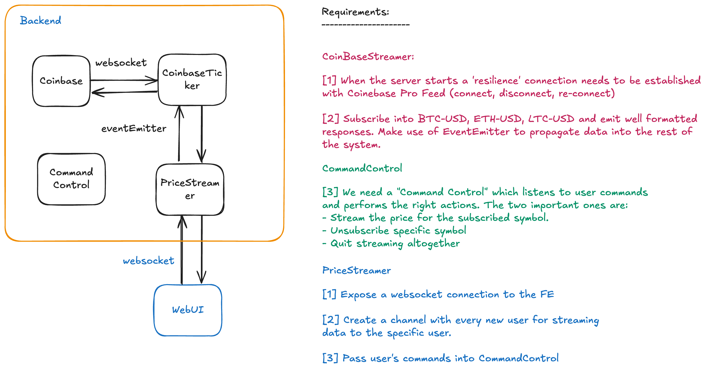
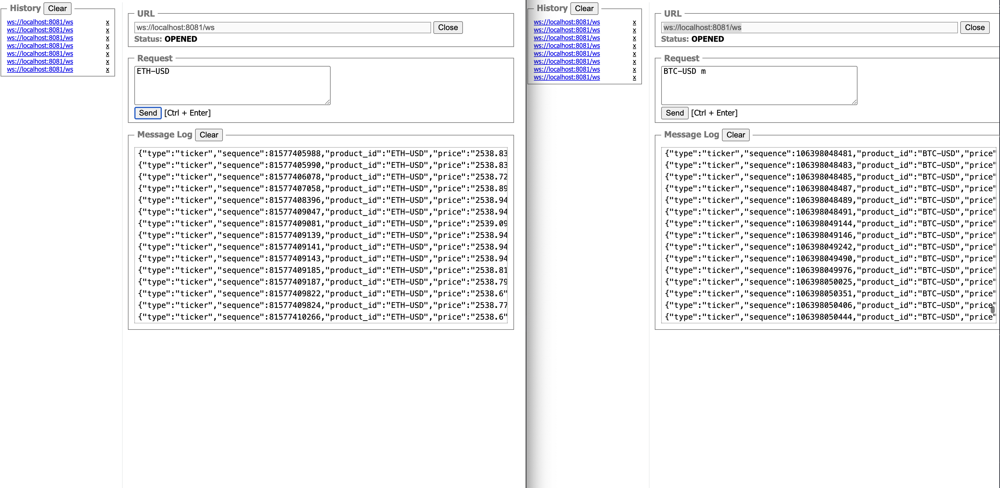

# Coinbase Ticker

✨ A WebSocket feed to stream live market data from Coinbase

## 🦄 Screenshots

Diagram from the initial Brainstorming



A working example of the final application



## 👀 Core Features

- NodeJS v22.0.0
- Typescript
- Testing with Vitest
- Linting with ESLint, Prettier, Editorconfig
- Pre-commit hook with Husky and Lint-Staged

## 🚀 Project Structure

| Name                              | Description                                           |
| --------------------------------- | ----------------------------------------------------- |
| **server.ts**                     | The main server that setups the connections           |
| **src/**                          | Source files                                          |
| **src/@types**                    | Typings shared among different modules                |
| **src/services/coinbase-ticker**  | A Webserver that subscribes to Coinbase               |
| **src/services/websocket-server** | The user facing websocket server for streaming assets |

## 📗 Getting Started

```sh
# Install Dependecies
pnpm install

# Run Server
pnpm start
```

The server runs in the following URL: `ws://localhost:8081/ws`

For testing you can use the following plugin:

<https://chromewebstore.google.com/detail/websocket-test-client/fgponpodhbmadfljofbimhhlengambbn>
